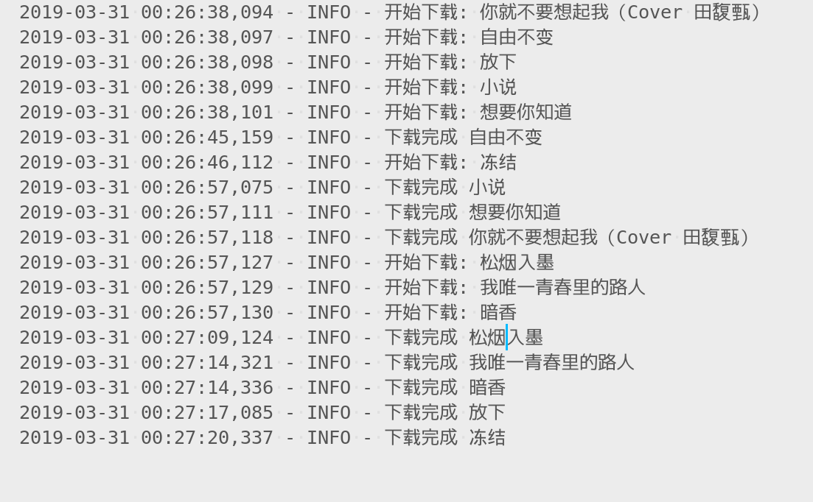

# netease-music-crawl

## 功能
这个项目主要是用来爬取网易云音乐的个人喜欢的音乐。如果你知道其他音乐的id，那么你也可以改写本项目。

## 配置文件

### 设置playlistid
你只需要在配置setting.py文件中设置你的主页的playlistid即可。你的playlistid应该设置在setting.py文件的`PLAY_LIST_ID`变量。

例如，我喜欢的音乐的url为`https://music.163.com/#/playlist?id=2217611952&_hash=songlist-471188016`，那么我的playlistid就是2217611952，那么我就应该在配置文件setting.py中出现`PLAY_LIST_ID = 2217611952`，当然，你喜欢的音乐肯定和我不一样，那么你只需要改写这个变量即可。

### 设置最大线程数量
为了加快下载速度，本项目使用了多线程下载。在配置文件中，`MAX_THREAD_NUMBER`就是表示最大的线程数量。建议不要更改默认值，因为默认情况下已经可以达到8M网速的顶峰了，再添加线程对网速的影响不会太大，但是会加大下载失败的概率，因为频率过快地下载可能会失败。

### 设置失败后的尝试次数
下载一个文件不可能100%地成功，所以这里使用`MAX_DEEP`来尝试尝试的最大次数。如果下载的次数超过MAX_DEEP还没有下载成功，则放弃下载该音乐文件。

### 设置超时时间
在setting文件中设置TIME_OUT变量以设置超时时间

## 运行程序
在终端运行`sh start.sh`即可。

## 日志
当允许程序后，所有的日志都存储在了`log.txt`（运行时创建），所以如果你需要查看问题或者是运行的情况的时候，你可以查看`log.txt`文件。

log文件一般类似于下图所示：

## 结果
所有的下载的音乐都下载在当前文件夹的resource文件夹下（运行时创建)。

注意： 由于一些歌曲是需要付费的，这一部分目前还无法爬取，所以下载的歌曲的数量可能会少于你在网上显示的数量，这是因为程序自动删除了无效的歌曲。

## 其他
本项目只写了下载个人喜欢的音乐，你也可以去实现其他的功能。
download_list.py是下载音乐的列表。
download_music.py是下载一个MusicItem，你需要提供音乐的id和名称。
所以说，你也是可以根据音乐的id和名称取下载你想要其他的音乐。

## 问题
有任何问题，欢迎在github发issue，我看到后会尽量回复。
当然，你也可以email我，我的email是`qingyingliu671@foxmail.com`。

